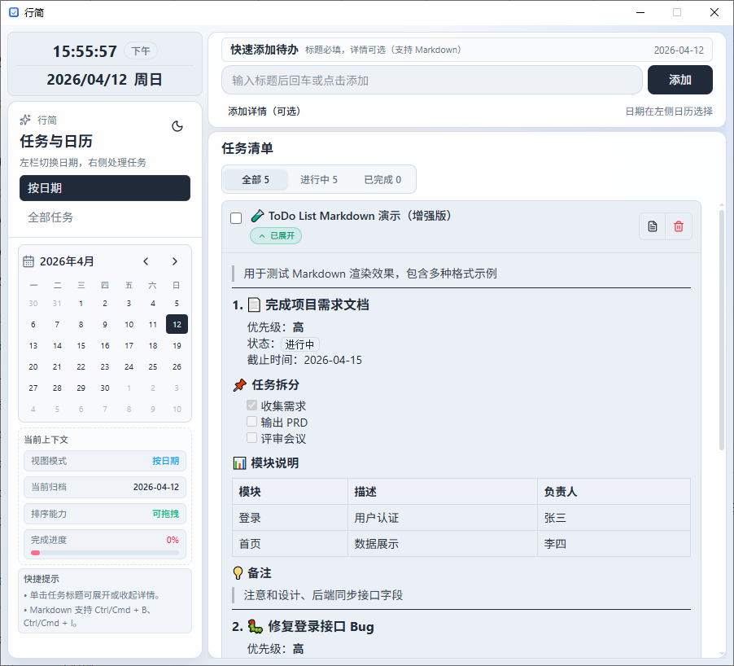
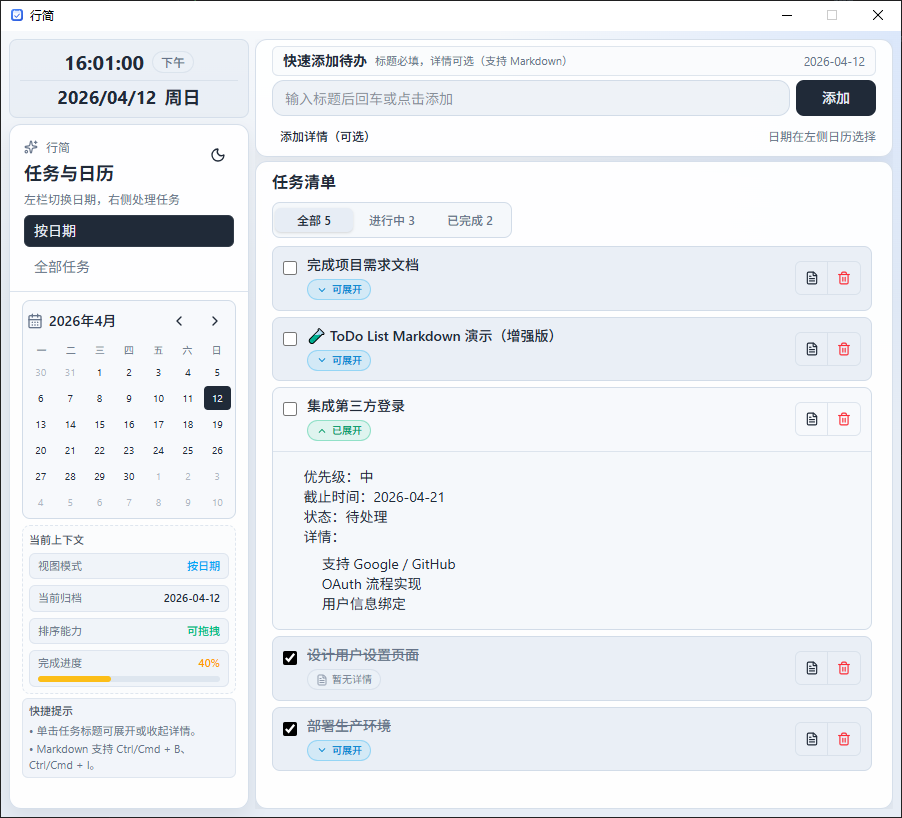

# 行简（EasyStep-Do）

行简是一个桌面端待办应用，基于 **Tauri 2 + React + TypeScript** 构建。  
它强调「快速记录、按日期归档、可视化整理、桌面原生体验」。

- 当前版本：`1.0.4`
- 应用标识：`cn.rainss.easystepdo`
- 发布者：`浅语`

---

## 演示截图





---

## 核心特性

### 1) 日期驱动的任务管理
- 左侧日历选择日期，右侧仅显示该日期任务
- 支持切换「按日期 / 全部任务」视图
- 展示总数、完成数、完成率等上下文信息

### 2) 快速添加与详情编辑
- 顶部快速添加输入框，回车/按钮即可创建
- 详情为可选 Markdown 内容
- 编辑时使用弹层（模态）而非行内编辑，交互更清晰

### 3) Markdown 高效编辑器
- 支持三种模式：**分屏 / 编辑 / 预览**
- 工具栏支持：粗体、斜体、标题、代码、列表、删除线、任务/完成、引用、链接、代码块、表格、分割线
- 快捷键：`Ctrl/Cmd + B`（粗体）、`Ctrl/Cmd + I`（斜体）
- 工具栏操作会尽量保留光标与滚动位置，连续编辑更顺手

### 4) 任务交互与排序
- 勾选完成状态
- 删除前二次确认，降低误删风险
- 支持拖拽排序（按日期视图下启用）

### 5) 桌面原生体验
- 关闭主窗口后最小化到托盘（不直接退出）
- 托盘菜单支持：显示主窗口 / 开机自启开关 / 退出应用
- 应用采用单实例模式：重复启动会激活已运行实例并显示主窗口，不会创建重复托盘图标
- Markdown 中外链默认调用系统浏览器打开

### 6) 本地数据存储
- 使用 SQLite 本地持久化（`rusqlite + bundled`）
- 数据保存在 Tauri 应用数据目录下

---

## 技术架构

## 前端（WebView）
- React 19
- TypeScript 6
- Vite 8
- Tailwind CSS 4
- dnd-kit（拖拽排序）
- react-markdown + remark-gfm + rehype-sanitize（Markdown 渲染）

## 后端（Tauri / Rust）
- Tauri 2
- tauri-plugin-autostart（开机自启）
- tauri-plugin-log（开发日志）
- rusqlite（SQLite）
- chrono / uuid
- webbrowser（系统浏览器打开链接）

## 前后端通信
- 前端通过 `@tauri-apps/api` 的 `invoke` 调用 Rust 命令
- 关键命令：`list_todos`、`add_todo`、`toggle_todo`、`update_todo`、`delete_todo`、`reorder_todo`、`open_external_url`

---

## 项目结构（简要）

```text
.
├─ src/                        # React 前端
│  ├─ App.tsx                  # 主界面与交互逻辑
│  ├─ components/
│  │  ├─ markdown-editor.tsx   # Markdown 编辑器
│  │  └─ ui/                   # 通用 UI 组件
│  └─ api/todo.ts              # invoke 封装
├─ src-tauri/
│  ├─ src/lib.rs               # Tauri 入口、托盘、命令注册
│  ├─ src/todo.rs              # 任务命令实现
│  ├─ src/db.rs                # SQLite 初始化与迁移
│  └─ tauri.conf.json          # 应用/打包配置
├─ screenshot/                 # README 演示截图
└─ .github/workflows/
   └─ build-tauri.yml          # 跨平台构建与自动发版
```

---

## 本地开发

## 环境要求
- Node.js 20+
- Rust stable（建议通过 rustup）
- Tauri 2 相关系统依赖（按官方文档）

## 安装依赖
```bash
npm ci
```

## 启动开发模式
```bash
npm run tauri:dev
```

## 代码检查
```bash
npm run lint
```

---

## 构建与打包

## 生产构建
```bash
npm run tauri:build
```

Windows 下默认会生成：
- `src-tauri/target/release/bundle/msi/*.msi`
- `src-tauri/target/release/bundle/nsis/*-setup.exe`

## 便携版（Windows）
可直接分发可执行文件（或自行压缩为 zip）：

```bash
npm run build
cargo build --release --manifest-path src-tauri/Cargo.toml
```

产物：
- `src-tauri/target/release/app.exe`

---

## CI/CD：跨平台自动构建与发版

仓库已提供 GitHub Actions 工作流：
- `.github/workflows/build-tauri.yml`

功能：
- Windows：`msi + nsis + portable zip`
- macOS：`app + dmg`
- Linux：`appimage + deb + rpm`
- 当推送 `v*` 标签时，自动创建 GitHub Release 并上传安装包

## 手动触发
在 GitHub Actions 页面运行 `Build Tauri (Win/macOS/Linux)`。

## 标签发版示例
```bash
git tag -a v1.0.0 -m "release: v1.0.0"
git push origin v1.0.0
```

---

## 注意事项

- 修改 `src-tauri/tauri.conf.json` 中的 `identifier` 会影响应用数据目录。  
  如果你修改了 identifier，看起来像“数据丢失”，通常是因为应用切到了新的数据目录。
- MSI 打包中文信息依赖 WiX 语言配置，当前已设置为 `zh-CN`。

---

## License

如需开源发布，请在此补充许可证信息。